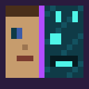
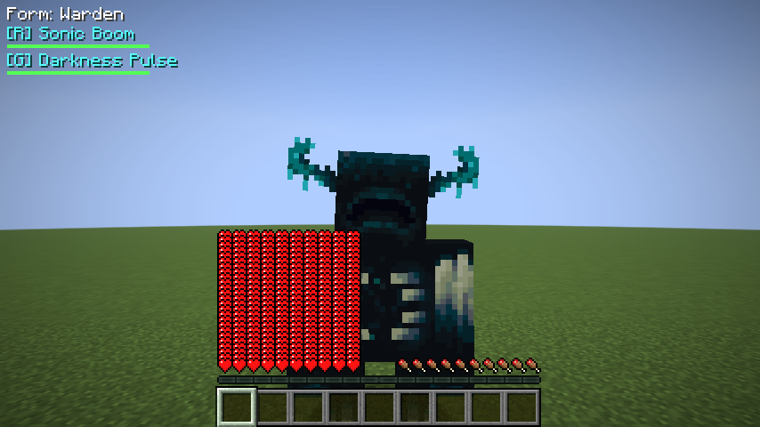
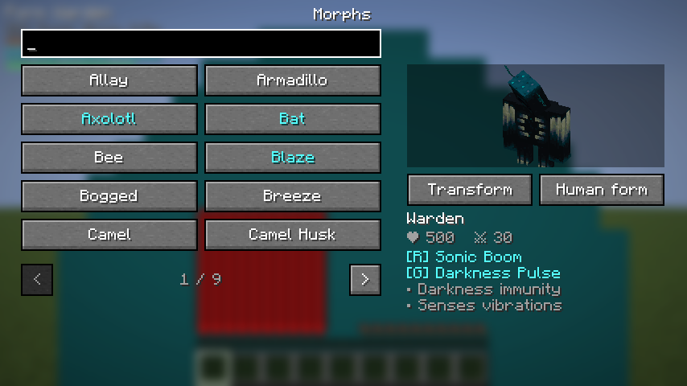
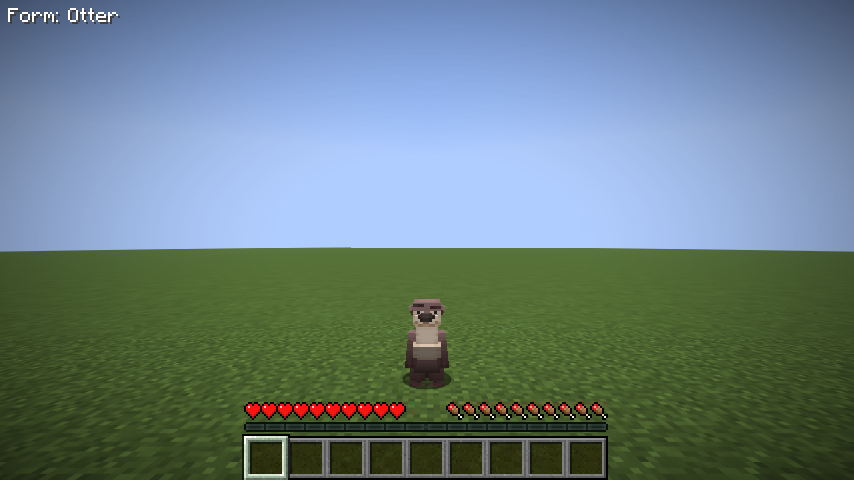
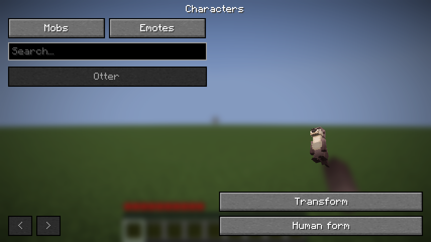

<p align="center">
  
</p>

<h1 align="center">Morph</h1>

<p align="center">
  Conviértete en mobs o en tus propios personajes animados, y añade bailes con GeckoLib.
</p>

<p align="center">
  
  
  
  
  
</p>

---

<p align="center">
  
  
</p>

## ¿Qué hace?

**Morph** es un mod de [Fabric](https://fabricmc.net/) que te permite transformarte en los mobs del mundo.
Al transformarte:

- **Tomas su forma**: ves y te ven con el modelo, la textura y las animaciones del mob, y tu hitbox y altura de ojos pasan a ser las suyas. Un murciélago cabe por un agujero de un bloque; un Warden no cabe por una puerta.
- **Heredas sus stats**: vida máxima, daño, velocidad, armadura, resistencia al empuje, altura de paso...
- **Usas sus poderes**: habilidades activas en las teclas **R** y **K**, y pasivas siempre activas, como volar, trepar paredes, no quemarte o respirar bajo el agua.

Por ejemplo, como **Warden** tienes 500 de vida y 30 de daño, lanzas el **Estallido sónico** (R), que atraviesa la armadura, lanzas un **Pulso de oscuridad** (K) y **percibes las vibraciones**: las criaturas que se mueven cerca brillan a través de las paredes.

## Cómo se juega

1. **Mata un mob** para desbloquear su forma. Verás un mensaje en el chat.
2. Pulsa **J** para abrir el menú de formas, elige una y pulsa **Transformarse**.
3. Usa **R** y **K** para las habilidades. El HUD muestra la forma actual y los cooldowns.
4. Pulsa la tecla que asignes a «volver a humano» para volver a tu forma humana.

| Tecla | Acción |
|---|---|
| `J` | Abrir el menú de formas |
| `R` | Habilidad principal |
| `K` | Habilidad secundaria |
| Sin asignar | Volver a forma humana |

Puedes cambiar las teclas en *Opciones → Controles → Morph*.

Para personajes personalizados, abre **J → Personajes**. Elige **Otter** para probar
la plantilla incluida y entra en **Emotes** para reproducir `demo_dance`, un emote de
ejemplo añadido por el mod (la animación original de la nutria es su caminar e idle). Puedes
asignar una tecla al menú de emotes desde los controles.

<p align="center">
  
  
</p>

## Mobs con poderes (v0.1)

| Mob | Vida | Poder R | Poder K | Pasivas |
|---|---|---|---|---|
| **Warden** | 500 | Estallido sónico | Pulso de oscuridad | Inmune a oscuridad, percibe vibraciones, sin empuje |
| Creeper | 20 | Explotar (sin dañarte) | — | Sin daño por caída |
| Enderman | 40 | Teletransporte (32 bloques) | — | Más alcance; el agua le daña |
| Blaze | 20 | 3 bolas de fuego | — | Inmune al fuego, caída lenta; el agua le daña |
| Araña | 16 | — | — | Trepa paredes, visión nocturna |
| Murciélago | 6 | — | — | Vuela, visión nocturna |
| Gólem de hierro | 100 | Lanzar por los aires | — | Sin empuje, sin daño por caída |
| Esqueleto | 20 | Disparar flecha | — | Arde bajo el sol |
| Ghast | 10 | Bola de fuego explosiva | — | Vuela, inmune al fuego |
| Ajolote | 14 | Hacerse el muerto | — | Respira bajo el agua, nado rápido |

**Cualquier otro mob compatible** también se puede usar: toma su forma, su vida, su daño y su armadura, aunque no tiene poderes propios.
Se excluyen jugadores, soportes para armaduras, maniquíes y el dragón. En el menú, los mobs con poderes aparecen en azul y llevan una estrella. La tabla completa está en [docs/MOBS.md](docs/MOBS.md).

## Comandos

| Comando | Permiso | Descripción |
|---|---|---|
| `/morph list` | todos | Lista tus formas desbloqueadas |
| `/morph into <mob> [jugadores]` | OP | Transforma sin necesidad de desbloquear |
| `/morph clear [jugadores]` · `/demorph` | OP | Vuelve a forma humana |
| `/morph unlock <mob\|all> [jugadores]` | OP | Desbloquea formas |
| `/morph reset <jugadores>` | OP | Borra formas desbloqueadas y destransforma |

## Configuración

El archivo `config/morphmod.json` se crea en el primer arranque y solo lo lee el servidor:

```json
{
  "schemaVersion": 2,
  "requireUnlock": true,
  "unlockOnKill": true,
  "maxHealthCap": 500.0,
  "damageMultiplier": 1.0,
  "cooldownMultiplier": 1.0,
  "allowFlight": true,
  "abilitiesBreakBlocks": false,
  "creeperBreaksBlocks": true
}
```

- `requireUnlock: false` desbloquea todas las formas para todo el mundo.
- `maxHealthCap` limita la vida de cualquier forma. Bájalo a `100` si el Warden te parece demasiado fuerte.
- Las explosiones respetan además la regla `mobGriefing`.

## Instalación

1. Instala [Fabric Loader](https://fabricmc.net/use/) **0.19.5+** para Minecraft **26.1.x, 26.2 o 26.3**.
2. Descarga [Fabric API](https://modrinth.com/mod/fabric-api) y ponla en `mods/`.
3. Instala **GeckoLib 5** para tu versión: 5.5.2 en 26.1.2, 5.5.5 en 26.2 y 5.5.7 en 26.3.
4. Pon `morphmod-x.y.z+mc<versión>.jar` en `mods/`.

El mod se necesita **en el cliente y en el servidor**.

## Personajes personalizados y bailes (0.3.0)

Desde **J → Personajes** puedes elegir modelos propios con textura y animaciones
GeckoLib. Conservan estadísticas y colisión humanas, salvo que su manifiesto los
vincule explícitamente a un mob. La plantilla **Otter** se instala automáticamente
en `config/morphmod/characters/otter/` al iniciar el servidor o un mundo local.

Para añadir otro personaje, crea una carpeta en `config/morphmod/characters/` con
`character.json`, el modelo `.geo.json`, las animaciones `.animation.json` y la
textura `.png`. Ejecuta `/morph character reload`: el servidor valida el catálogo
y distribuye los recursos a los clientes, que los guardan en caché por su hash.

Abre **Emotes** desde el menú o asigna su tecla en Controles. Un baile **completo**
se detiene al moverte o actuar; uno **superpuesto** anima los huesos de su máscara
y permite caminar. La nutria incluye `demo_dance`, un emote de ejemplo añadido por el
mod (balancea brazos y cabeza) que no forma parte de sus animaciones originales,
en ambos modos.

```text
/morph character list
/morph character select morphmod:otter
/morph emote play demo_dance full
/morph emote play demo_dance overlay
/morph emote stop
/morph character clear
```

**LuckPerms es opcional y se instala en el servidor.** Los permisos de grupos y
jugadores se consultan con sus contextos actuales. Una denegación explícita bloquea
el acceso; sin nodo definido se usa `free` o el desbloqueo del personaje.
Los nodos de la plantilla son `morphmod.character.use.morphmod.otter` y
`morphmod.emote.use.morphmod.otter.demo_dance`. Recargar y desbloquear requieren
`morphmod.characters.admin` (OP nivel 2 por defecto).

Consulta [la guía de personajes](docs/PERSONAJES.md) para el manifiesto, anclajes,
perfiles de animación, permisos y límites.

## Compilar desde el código

Requisitos: **JDK 25**. Gradle lo descarga solo si no lo tienes instalado.

```bash
git clone https://github.com/AloneX15/morph-mod.git MINECRAFT-MORPH-MOD
cd MINECRAFT-MORPH-MOD
./gradlew :26.1.2:build :26.2:build :26.3:build  # jars y pruebas unitarias/de servidor
./gradlew :26.3:runGameTest -PcompatPack         # Lithium + FerriteCore
./gradlew :26.3:runGameTest -PluckPerms          # herencia y denegaciones de permisos
./gradlew :26.3:runClientGameTest                # UI, modelos, red y capturas
./gradlew :26.3:runClient                        # desarrollo
```

## Documentación

- **[Wiki completa](docs/wiki/Home.md)**: 61 páginas con guías de juego, servidores, personajes, animaciones y desarrollo.
- [Wiki en español](docs/wiki/ES-Index.md) · [Wiki in English](docs/wiki/EN-Index.md).

La documentación se puede consultar directamente en este repositorio. Para publicarla
también en la [pestaña Wiki](https://github.com/AloneX15/morph-mod/wiki), crea su primera
página y exporta el contenido con `node scripts/export-wiki.mjs`.

Referencias e historial del repositorio:

- [Plan inicial](docs/PLAN_INICIAL.md): visión, alcance, hitos y riesgos
- [Bitácora](docs/BITACORA.md): diario de desarrollo
- [Arquitectura](docs/ARQUITECTURA.md): cómo funciona por dentro y cómo añadir un mob
- [Mobs](docs/MOBS.md): stats y poderes de cada forma
- [Personajes y emotes](docs/PERSONAJES.md): importar modelos y animaciones GeckoLib
- [Changelog](CHANGELOG.md) · [Cómo contribuir](CONTRIBUTING.md)

## Hoja de ruta

- [x] v0.1: sistema de morph, 10 mobs con poderes, menú, HUD, comandos y configuración
- [x] v0.3: personajes GeckoLib, catálogo del servidor, emotes y permisos opcionales
- [ ] Más mobs con poderes (Wither, Dragón, Phantom, Breeze, Guardian...)
- [ ] Mobs de la misma especie no te atacan (un creeper no te persigue si eres creeper)
- [ ] Animaciones de ataque del mob al usar poderes
- [ ] Definir morphs por datapack (JSON)
- [ ] Integración con Mod Menu y Cloth Config
- [ ] Publicación en Modrinth y CurseForge

## Licencia

[MIT](LICENSE)

---

### English summary

**Morph** is a Fabric mod for Minecraft 26.1.x, 26.2 and 26.3. Kill a mob to unlock its form, press **J** to choose a form, and take on its model, hitbox, stats and powers. Use **R** and **K** for abilities and the menu button or your configured demorph key to return to human form. For example, the Warden has 500 HP, a Sonic Boom that ignores armor, a Darkness pulse and vibration sense. Every supported living mob can be used; 10 of them have hand-made powers in v0.1. Build with JDK 25 and `./gradlew :26.3:build`.

## Compatibilidad

Un jar por versión: 26.1.2 (rango 26.1.x), 26.2 y 26.3. Java 25, Fabric Loader
0.19.5+, Fabric API y GeckoLib 5 son obligatorios. No se incluyen snapshots ni versiones previas a 26.1.
Las matrices de CI prueban cada jar con y sin Lithium y FerriteCore, además del cliente.
Consulta [MIXINS.md](MIXINS.md) para posibles conflictos con mods de tamaño, movimiento o render.

Los atajos por defecto son J (menú), R (principal) y K (secundaria). La vuelta a humano
queda sin asignar; puedes usar el botón del menú o asignar una tecla en Controles.
Si un atajo conserva su valor por defecto y tiene conflicto, se busca J/K/R libre;
si no hay ninguna libre, se deja sin asignar. Las preferencias del usuario se respetan.

La red usa protocolo 2; se ignoran solicitudes incompatibles y se limita la frecuencia.
Los comandos siguen disponibles para clientes sin los canales de Morph; esos clientes
no muestran el modelo ni la UI del mod. Para todas las funciones, instálalo en ambos lados.

La configuración tiene `schemaVersion: 2`; valores antiguos se migran conservando ajustes.
JSON inválido se guarda en `.bak`; números no finitos se sustituyen por defaults.
Las explosiones de habilidades no rompen bloques por defecto (`abilitiesBreakBlocks: false`), salvo la del Creeper, que rompe bloques como el mob real si `mobGriefing` está activo (`creeperBreaksBlocks: true`).

## Desarrollo

Versiones en `stonecutter.properties.toml`; activa: 26.3. Código compartido en `src/`,
diferencias de API con ramas Stonecutter. Jars en `versions/<mc>/build/libs/`.
Los pushes a main publican la pre-release dev después de superar toda la matriz.
Tags vX.Y.Z deben coincidir con mod.version y tener sección propia en CHANGELOG.md.

[Revisión del estándar](docs/CUMPLIMIENTO.md) · [Registro de errores](docs/registro-de-errores.md) · [Seguridad](SECURITY.md).

Creado por **TakumiStudios**.
