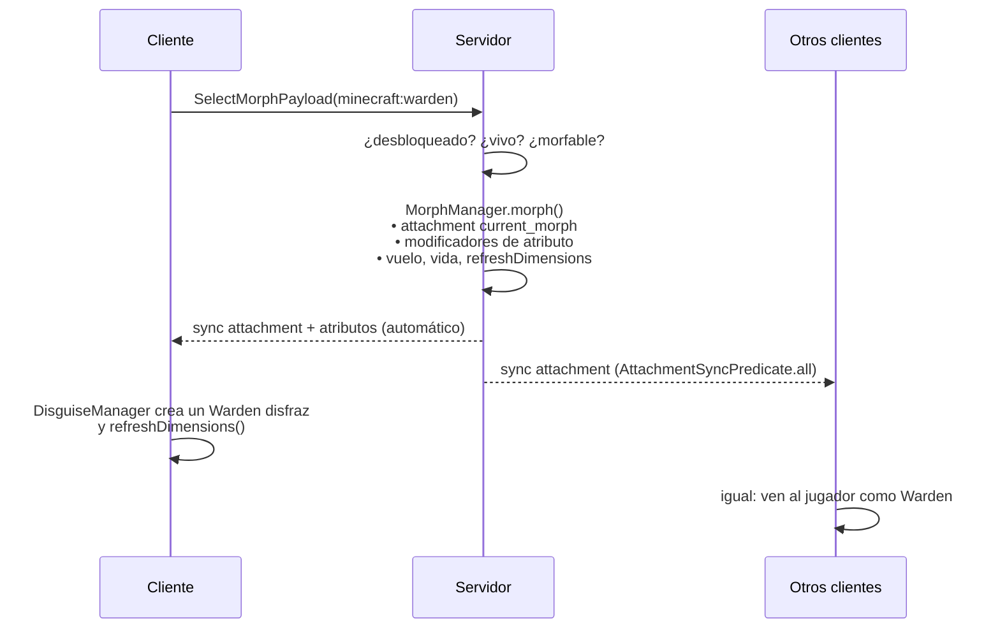
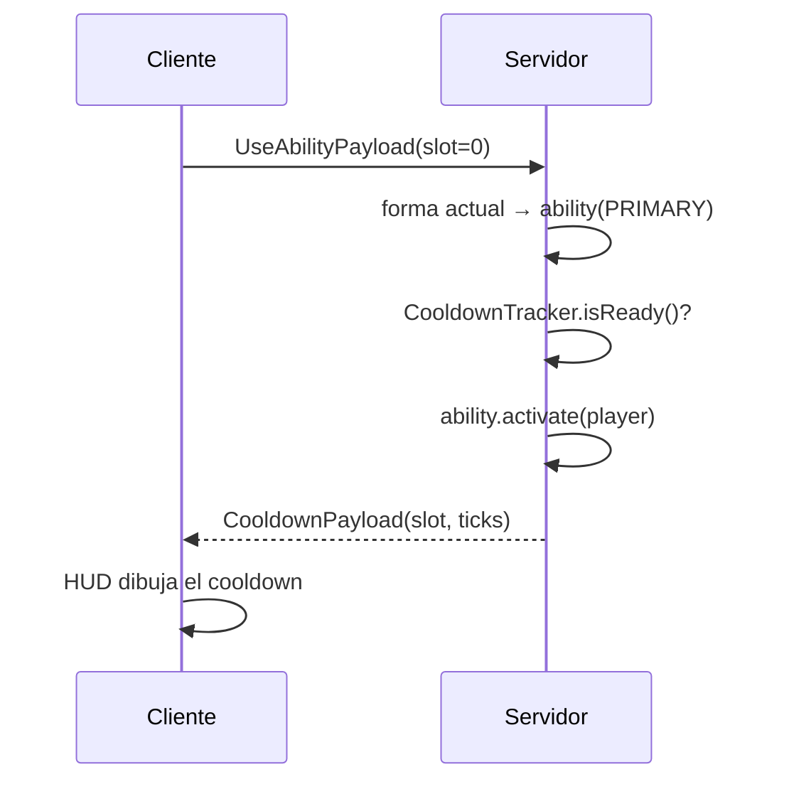

# Arquitectura

## Estructura del código

```
src/
├── main/java/com/takumistudios/morphmod/          ← común (cliente + servidor)
│   ├── MorphMod.java                         entrypoint: registra todo
│   ├── ability/                              MorphAbility, AbilitySlot
│   │   └── impl/                             SonicBoom, DarknessPulse, Explode, Teleport, Fireball, Arrow, Fling, PlayDead
│   ├── command/MorphCommand.java             /morph, /demorph
│   ├── config/MorphConfig.java               config/morphmod.json (Gson)
│   ├── data/MorphAttachments.java            current_morph, unlocked_morphs
│   ├── event/MorphEvents.java                desbloqueo al matar, inmunidades, tick de pasivas, join/respawn
│   ├── mixin/                                AvatarMixin (hitbox), PlayerMixin (trepar)
│   ├── morph/                                MorphDefinition, MorphRegistry, MorphManager, Passive
│   ├── network/                              payloads + MorphNetworking (handlers del servidor)
│   └── util/                                 CooldownTracker, StatMath (Java puro, con tests)
├── client/java/com/takumistudios/morphmod/client/ ← solo cliente
│   ├── MorphModClient.java                   entrypoint de cliente
│   ├── MorphKeybinds.java                    J / R / K / sin asignar
│   ├── ClientMorphState.java                 cooldowns para el HUD
│   ├── hud/MorphHud.java
│   ├── screen/MorphSelectScreen.java
│   ├── render/DisguiseManager.java           entidades disfraz
│   └── mixin/                                LevelExtractorMixin (render), MinecraftMixin (vibraciones), WalkAnimationStateAccessor
├── test/java/                                JUnit (lógica pura)
└── gametest/java/                            tests de servidor y cliente dentro del juego
```

## Flujo de una transformación



## Flujo de una habilidad



## Piezas clave

### Datos (`MorphAttachments`)
- `current_morph : Identifier`: persistente, se sincroniza **a todos** (los demás necesitan saber qué dibujar) y **no** se copia al morir.
- `unlocked_morphs : List<Identifier>`: persistente, se sincroniza **solo al dueño** (para el menú) y se copia al morir.

### Stats (`MorphManager.applyStats`)
Cada `MorphDefinition` guarda valores **absolutos**, por ejemplo `MAX_HEALTH = 500`. Para cada uno se calcula
`modificador = objetivo − base del jugador` y se aplica un `AttributeModifier(ADD_VALUE)` con el id `morphmod:morph`.
Al volver a forma humana se borra ese id en todos los atributos. La vida se reescala para conservar el porcentaje (10/20 → 250/500).

### Hitbox (`AvatarMixin`)
`Avatar#getDefaultDimensions(Pose)` devuelve `EntityType#getDimensions()` del mob, que ya incluye la altura de ojos.
Cuando cambia el morph, el cliente llama a `refreshDimensions()` desde `DisguiseManager.tick`.

### Render (`DisguiseManager` + `LevelExtractorMixin`)
1. Por cada jugador transformado se crea una entidad del tipo del mob que **nunca se añade al mundo**.
2. En cada tick se le llama a `tick()` para que avancen sus animaciones (alas del murciélago, tentáculos del Warden). Si falla, ese tipo de mob se marca y se dibuja sin animaciones.
3. En cada frame se copian posición, rotaciones, `walkAnimation`, `hurtTime`, fuego, etc. del jugador.
4. `LevelExtractorMixin` envuelve la extracción del estado de render de las entidades del mundo. Si la entidad es un jugador transformado, extrae el estado del disfraz, y el renderer del propio mob lo dibuja.

> En 26.x el jugador local también se extrae aparte para las manos en primera persona, y ese estado **tiene** que ser de jugador.
> Por eso el mixin está en `extractVisibleEntities` y no en `EntityRenderDispatcher#extractEntity`.

### Pasivas
| Pasiva | Implementación |
|---|---|
| Inmune al fuego / sin daño por caída | `ServerLivingEntityEvents.ALLOW_DAMAGE` |
| Visión nocturna, caída lenta, nado rápido | Efecto ambiental oculto que se renueva cada tick |
| Respira bajo el agua | `setAirSupply(max)` |
| Trepa paredes | `PlayerMixin#onClimbable` (en los dos lados) |
| Vuelo | `Abilities.mayfly` + `onUpdateAbilities()` |
| El agua daña / arde al sol | Comprobación periódica en `tickPassives` |
| Inmune a oscuridad | Se elimina el efecto Darkness |
| Percibe vibraciones | `MinecraftMixin#shouldEntityAppearGlowing` (solo cliente) |

## Cómo añadir un mob con poderes

1. Si necesitas una habilidad nueva, crea una clase en `ability/impl` que implemente `MorphAbility`:
   ```java
   public final class MiPoder implements MorphAbility {
       public String id() { return "mi_poder"; }           // ability.morphmod.mi_poder
       public int cooldownTicks() { return 5 * 20; }
       public boolean activate(ServerPlayer player) { ...; return true; }
   }
   ```
2. Regístralo en `MorphRegistry.init()`:
   ```java
   register(MorphDefinition.builder(EntityTypes.PHANTOM)
       .stat(Attributes.MAX_HEALTH, 20.0)
       .passive(Passive.FLIGHT, Passive.BURNS_IN_SUN)
       .primary(new MiPoder())
       .build());
   ```
3. Añade las traducciones `ability.morphmod.mi_poder` en `en_us.json` y `es_es.json`.
4. Documenta el mob en [MOBS.md](MOBS.md) y en el [CHANGELOG](../CHANGELOG.md).

## Fiabilidad y compatibilidad (0.2.0)

`FeatureGuard` contiene fallos por callback y habilidad; los hooks de render y mixins
mantienen vanilla como alternativa. `SafeCommand` conserva errores de sintaxis de
Brigadier y desactiva únicamente la acción que falla.

La configuración se lee en Morph-IO antes de registrar callbacks; solo se espera
al cargar el mod, nunca durante el tick. Cierre en SERVER_STOPPING con espera acotada.
JSON corrupto se conserva en .bak; reemplazo atómico, esquema 1 y números finitos.

`ProtocolPayload` negocia versión 1 al conectar. Solo clientes negociados envían
solicitudes; servidor valida estado, unlocks, existencia, longitud y slots. Rate limit
por jugador; limpieza en desconexión. Sin negociación, siguen los comandos.
Alcance/colisión/objetivos de poderes siempre se calculan en el servidor.

`MorphManager` solo recorre UUID transformados. Adjuntos envían cambios automáticamente
al observador que sigue la entidad; unlocks solo al propietario. El límite es 4096 formas.
HUD y detalles del menú cachean textos fuera del render; previews LRU de 16 entradas;
disfraces limitados a jugadores visibles y liberados al salir del mundo.

Stonecutter genera código compartido para 26.1.2, 26.2 y 26.3. Registro de entidades
por IDs comunes; ramas para extracción, pantallas y arnés de cliente de 26.1.x.
## Personajes y emotes (0.3.0)

`CharacterCatalog` carga carpetas en un executor y publica un catálogo inmutable.
`CharacterBundle` valida manifiesto, geometría, canales, textura y presupuestos;
crea archivos ZIP deterministas y hashes SHA-256. `CharacterNetworking` negocia
recursos en configuración y en juego, limita los fragmentos por tick y envía
metadatos de acceso por jugador. `ClientCharacters` valida, cachea y prepara un
paquete de recursos GeckoLib antes de cambiar el catálogo visible.

`CharacterManager` mantiene selección y emotes autoritativos en el servidor.
La selección persiste como adjunto sincronizado; el baile es transitorio y contiene
ID, modo e instante inicial. Los desbloqueos persisten por jugador. LuckPerms se
carga opcionalmente y sus contextos e herencia determinan el acceso. Se revisan
permisos cada segundo; select/play vuelven a comprobarlos inmediatamente.

`CharacterEntity` es un proxy separado que nunca se añade al mundo del servidor.
Refleja pose, equipo y movimiento del propietario. Sus controladores GeckoLib
combinan locomoción, manos, combate y emotes. Las variantes overlay se preparan
filtrando los canales de animación a la máscara declarada. Cada observador crea
su propio proxy a partir de los adjuntos y los recursos recibidos.

`CharacterRenderer` usa anclajes para objetos, armadura y élitros. El pase del
mundo usa el reemplazo existente de formas; el inventario tiene un hook específico.
La extracción del avatar local se conserva para que Minecraft pueda renderizar
la cámara y los objetos de primera persona. Un hook de manos sustituye sus brazos.
El HUD muestra el nombre del personaje y las habilidades de su mob vinculado.

Protocolo actual: **2**. Los detalles del formato de personajes y su importación
están en [PERSONAJES.md](PERSONAJES.md).
