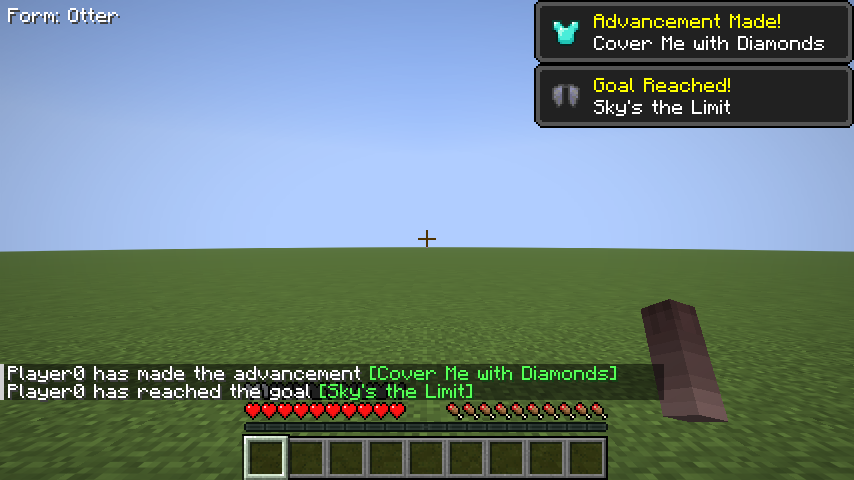

# Equipo y brazos en primera persona

Morph **0.3.0** · [Índice](ES-Index.md) · [English](EN-Equipment.md)

## Anclajes disponibles

| Nombre | Uso |
|---|---|
| `right_hand`, `left_hand` | Objetos en las manos |
| `head` | Casco |
| `chest` | Pechera |
| `right_arm`, `left_arm` | Segmentos de armadura y selección de brazo en primera persona |
| `right_leg`, `left_leg` | Segmentos de piernas |
| `right_foot`, `left_foot` | Botas |
| `elytra` | Élitros |

Un anclaje contiene un nombre de hueso y ajustes. Las piezas de armadura se ajustan automáticamente al cubo más grande del hueso (o del padre más cercano con cubos, para huesos localizadores vacíos como `armorBipedHead`). En los anclajes de armadura, `scale` multiplica ese ajuste automático (1 = ajustada al hueso) y `position` desplaza la pieza en unidades del modelo (16 unidades equivalen a un bloque); `rotation` no se usa en la armadura. En los objetos en mano (`right_hand`, `left_hand`) posición, rotación (grados) y escala son transformaciones locales del objeto. Los objetos en mano se escalan primero al tamaño del rig: un modelo con la mitad de altura que un jugador (32 unidades) sostiene objetos a la mitad de tamaño, entre 0,25 y 2; el `scale` del anclaje multiplica ese valor.

## Ejemplo con el rig Otter

~~~json
{
  "anchors": {
    "right_hand": {"bone": "right_hand_item", "rotation": [120, 0, 0]},
    "left_hand": {"bone": "left_hand_item", "rotation": [120, 0, 0]},
    "head": {"bone": "armorBipedHead"},
    "chest": {"bone": "body_upper", "position": [0, 2.6, 0], "scale": [1.15, 1.6, 1.5]},
    "right_arm": {"bone": "right_arm", "position": [0.2, -0.4, 0], "scale": [1.3, 1, 1.3]},
    "left_arm": {"bone": "left_arm", "position": [-0.2, -0.4, 0], "scale": [1.3, 1, 1.3]},
    "right_leg": {"bone": "right_leg", "position": [0, 0.7, 0]},
    "left_leg": {"bone": "left_leg", "position": [0, 0.7, 0]},
    "right_foot": {"bone": "right_leg", "position": [0, 0.7, 0]},
    "left_foot": {"bone": "left_leg", "position": [0, 0.7, 0]},
    "elytra": {"bone": "body_upper", "position": [0, 3.6, 0]}
  }
}
~~~

Los desplazamientos compensan pivotes que no están donde los de un jugador: `body_upper` tiene el pivote cerca de la base de su cubo, por eso la pechera sube 2,6 unidades y se estira (`scale`) para cubrir también la barriga (`body_lower`). Los huesos `right_hand_item`/`left_hand_item` vienen inclinados 60° en el rig; la rotación de 120° deja la hoja apuntando hacia arriba y al frente desde la pata. GeckoLib refleja el eje X, así que un desplazamiento X positivo aleja del cuerpo la pieza del brazo derecho.

Incorpora este fragmento a un manifiesto que use esos huesos. En tu propio rig, cambia nombres y offsets. Un anclaje inexistente se omite; no invalida por sí solo el personaje y el equipo mantiene sus efectos de juego.

## Mostrar el equipo en el morph

Por defecto la armadura y los objetos en mano están **ocultos** en todos los morphs (mobs y personajes); sus efectos de juego no cambian. Los jugadores con el permiso `morphmod.equipment.toggle` (OP nivel 2 sin LuckPerms) ven una pestaña con una pechera a la derecha del inventario. Alterna su propio morph entre mostrar y ocultar armadura y objetos en mano, y todos los jugadores ven el resultado. El ajuste se conserva al morir y al reconectar; se elimina si el jugador pierde el permiso.

## Ajustar en el juego

1. Activa la pestaña de equipo, carga el modelo sin equipo y verifica su escala visual.
2. Sujeta una espada y un objeto en la otra mano; comprueba ambos anclajes.
3. Usa arco, escudo y consumibles para revisar poses y mano activa.
4. Equipa casco, pechera, pantalones, botas y élitros.
5. Comprueba primera persona con la mano vacía y con objetos, en ambos brazos.
6. Ajusta offsets y recarga el catálogo.

La primera persona conserva la cámara y objetos de Minecraft mientras sustituye el brazo cuando el rig lo permite. La jerarquía de pivotes y los huesos descendientes importan. No todos los rigs admiten offsets idénticos ni una armadura visual perfecta sin ajustes.

`scale` del personaje cambia tamaño visual, no la colisión humana. Las escalas de anclajes afectan la colocación del equipo, no sus atributos.

---

[Inicio](Home.md) · [Índice completo](ES-Index.md) · [Ayuda](ES-Troubleshooting.md)

Creado por **TakumiStudios**.
